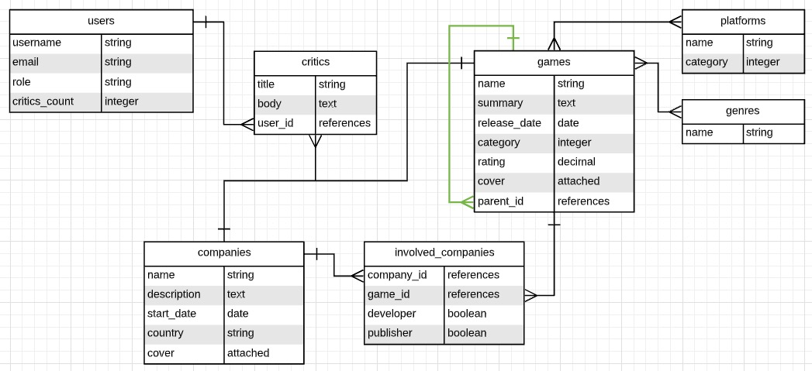

# Associations


That looks more convincing, right?

Now, every Game could have one or more Platforms ("PlayStation 4", "Nintendo Switch", etc.) and one or more Genres ("Shooter", "Racing", etc.). The category field will store 0 if it is a "Main Game" and a 1 if it is an "Expansion" (you can store more categories in this way). That's why the field type is an integer. For games with category 1 (expansions), the field parent_id will store the id of the related "Main Game".

The Platform entity also has a category attribute. This will store numbers representing the "type" of the particular platform like 0 for "console", 1 for "arcade", 2 for "platform", etc.

A Company is involved in the creation of a game as a developer, publisher, or both at the same time. This information is stored on the InvolvedCompany model.

The Users of the platform will make Critics of either Games or Companies. In both scenarios the critic is the same, it has a title and body. We will store the number of critics each user has made on the field critics_count.

## Task 1. Create models and tables

Following the ERD diagram create the following models. Run rails db:migrate after creating each model.

- User

```bash
rails generate model User username email role critics_count:integer
```

- Critic (do not worry about the relation with Company and Game yet)

```bash
rails generate model Critic title body:text user:references
```

- Company

```bash
 rails generate model Company name description:text start_date:date country cover
```

- Game (do not include parent_id field yet)

```bash
rails generate model Game name summary:text release_date:date category:integer reting:decimal cover
```

- Platform

```bash
 rails generate model Platform name category:integer
```

- Genre

```bash
rails generate model Genre name
```

- InvolvedCompany (reference a Company and reference a Game)

```bash
rails generate model InvolvedCompany company:references game:references  developer:boolean publisher:boolean
```

Look carefully at the relationship between Platform and Game, and between Genre and Game. Both are many-to-many relationships. But the join table won't store any information besides de foreign keys (for example, game_id and platform_id in the case of Game-Platform relation). In this particular scenario, it is not mandatory to have a model to map the join table. The relation could be mapped only with a special kind of association between the models (more on this coming soon). For now, we will only create the join tables on the database using a migration.

Check the docs to learn how to create join tables using the migration generator.

Then, create the required join tables without creating models (using only migrations).

- docs: https://guides.rubyonrails.org/active_record_migrations.html#creating-a-join-table

- Join table between the table games and the table platforms
- Join table between the table games and the table genres

# Task 2. Create basic model associations

For this task you will need to review these sections of Rails Guides:

## Why Associations?

\*_2 The Types of Associations_ (up to 2.8 Choosing Between has_many :through and has_and_belongs_to_many\*)
After reviewing the guides, create the associations marked with blue:


- A Critic belongs to a user
- A User has many critics

```ruby
class Critic < ApplicationRecord
  belongs_to :user
end
class User < ApplicationRecord
  has_many :critics, dependent: :nullify
end
```

- A Company has many involved_companies and has many games through involved_companies
- An InvolvedCompany belongs to a company and belongs to a game
- A Game has many involved_companies and has many companies through involved_companies

```ruby
class Company < ApplicationRecord
  has_many :involved_companies, dependent: :destroy
  has_many :games, through: :involved_companies
end
class Game < ApplicationRecord
  has_many :involved_companies, dependent: :nullify
  has_many :companies, through: :involved_companies
end

```

- A Game has and belongs to many platforms
- petition: Create a new platform in the Game involved

```bash
game.platforms.push(playstation)
```

### if not necessary to create another table in the case Game-Platform, because only save game_id and platform_id

```bash
rails generate migration CreateJoinTableGameToPlatform game platform
```

```bash
rails generate migration CreateJoinTableGameToGenre game genre
```

- A Game has and belongs to many genres
- A Platform has and belongs to many games
- A Genre has and belongs to many games

```ruby
class Game < ApplicationRecord
  has_many :involved_companies, dependent: :nullify
  has_many :companies, through: :involved_companies
  has_and_belongs_to_many :platforms
  has_and_belongs_to_many :genres
end
```

# Assocations Advances

## Self Joins

Now that the basic models and associations are ready let's take a look to the new ones. Let's start with the association marked in green:


As explained, there are some games that are a "child" from another game. For example the game "The Witcher 3: Wild Hunt - Hearts of Stone" is an expansion of the original game "The Witcher 3: Wild Hunt". In this case the relations would be:

- A Game could belongs to a parent
- A Game could have many expansions
  When a table have a relationship with itself it's called a Self Join

To learn more about self joins and how to implement them read the following article:

- https://guides.rubyonrails.org/association_basics.html#self-joins

### Task 1. Create a self join association

Test your models in the Rails console:

```bash
# create a game without parent
parent_game = Game.create(name: 'Parent game')
# create a game refereing the previous game as parent
expansion_game = Game.create(name: 'Expansion', parent: parent_game)
# list the expansions of parent_game
parent_game.expansions
# show the parent game of expansion_game
expansion_game.parent
# you can create new expansions using the assocation
parent_game.expansions.create(name: 'Expansion 2')
```

## How to create a self join?

1. Create a migration to add the parent_id column making a :parent references.

- First, we need realize a migration

```bash
rails generate migration AddParentRefToGame
```

- because, this attribute isn't in our table model

```ruby
class AddParentRefToGame < ActiveRecord::Migration[7.0]
  def change
    add_reference :games, :parent, null: true, foreign_key: {to_table: :games}
  end
end
```

- then, we need indicate the attribute null going to accept null values. And add the FK to the same model

2. Add new associations to Game model:

- A Game has many expansions of the class Game using the FK parent_id
- A Game belongs to a parent of the class Game (remember that this relationship is optional)

```bash
game = Game.create!(name:"GTA")
game_expansion = Game.create!(name:"GTA Expansion", parent_id:game.id)
```

```bash
game_expansion.parent
  Game Load (0.3ms)  SELECT "games".* FROM "games" WHERE "games"."id" = $1 LIMIT $2  [["id", 2], ["LIMIT", 1]]
=>
#<Game:0x00007f127601eea8
 id: 2,
 name: "GTA",
 summary: nil,
 release_date: nil,
 category: nil,
 reting: nil,
 cover: nil,
 created_at: Mon, 06 Jun 2022 12:54:29.449206000 UTC +00:00,
 updated_at: Mon, 06 Jun 2022 12:54:29.449206000 UTC +00:00,
 parent_id: nil>
irb(main):017:0>
```

```bash
game.expansions
  Game Load (0.8ms)  SELECT "games".* FROM "games" WHERE "games"."parent_id" = $1  [["parent_id", 2]]
=>
[#<Game:0x00007f1277b5d5c0
  id: 4,
  name: "GTA Expansion",
  summary: nil,
  release_date: nil,
  category: nil,
  reting: nil,
  cover: nil,
  created_at: Mon, 06 Jun 2022 12:55:40.969009000 UTC +00:00,
  updated_at: Mon, 06 Jun 2022 12:55:40.969009000 UTC +00:00,
  parent_id: 2>]
```

- Another form to add Expansion to parent

```bash
game_expansions_3 = Game.create!(name:"GTA EXPANSION 3")
```

```bash
game.expansions << game_expansions_3
  TRANSACTION (0.4ms)  BEGIN
  Game Update (1.0ms)  UPDATE "games" SET "updated_at" = $1, "parent_id" = $2 WHERE "games"."id" = $3  [["updated_at", "2022-06-06 12:59:23.307947"], ["parent_id", 2], ["id", 5]]
  TRANSACTION (1.0ms)  COMMIT
  summary: nil,
  release_date: nil,
  category: nil,
  reting: nil,
  cover: nil,
  created_at: Mon, 06 Jun 2022 12:59:10.026895000 UTC +00:00,
  updated_at: Mon, 06 Jun 2022 12:59:23.307947000 UTC +00:00,
  parent_id: 2>]
```

```bash
irb(main):021:0> tp game.expansions
ID | NAME            | SUMMARY | RELEASE_DATE | CATEGORY | RETING | COVER | CREATED_AT              | UPDATED_AT              | PARENT_ID
---|-----------------|---------|--------------|----------|--------|-------|-------------------------|-------------------------|----------
4  | GTA Expansion   |         |              |          |        |       | 2022-06-06 12:55:40     | 2022-06-06 12:55:40     | 2
5  | GTA EXPANSION 3 |         |              |          |        |       | 2022-06-06 12:59:10     | 2022-06-06 12:59:23     | 2
=> 0.002986035

```

# Polymorphic Associations

1. Create a migration to add a polymorphic reference criticable on the table critics.

```bash
rails generate migration AddCriticableToCritics criticable:references{polymorphic}
```

- 💡 Google how to generate migration polymorphic. Check your schema after you run the migration. You should se two new columns: `criticable_type` and `criticable_id`

2. Add the polymorphic relationships to the models:

- A `Critic` belongs to the polymorphic interface `criticable`
- A `Game` has many critics as `criticable`
- A `Company` has many critics as `criticable`

```bash
user = User.create!(username:"anthony")
game=Game.first
Critic.create(title:"Mi critica a gta", user: user, criticable:
game)
[#<Critic:0x00007ff2f6b99560
  id: 1,
  title: "Mi critica a gta",
  body: nil,
  user_id: 1,
  created_at: Mon, 06 Jun 2022 18:36:57.268084000 UTC +00:00,
  updated_at: Mon, 06 Jun 2022 18:36:57.268084000 UTC +00:00,
  criticable_type: "Game",
  criticable_id: 2>,
 #<Critic:0x00007ff2f6b99498
  id: 2,
  title: "Mi critica a gta",
  body: nil,
  user_id: 1,
  created_at: Mon, 06 Jun 2022 18:38:32.242029000 UTC +00:00,
  updated_at: Mon, 06 Jun 2022 18:38:32.242029000 UTC +00:00,
  criticable_type: "Game",
  criticable_id: 2>]
```

```bash
user.critics
[#<Critic:0x00007ff2f6b99560
  id: 1,
  title: "Mi critica a gta",
  body: nil,
  user_id: 1,
  created_at: Mon, 06 Jun 2022 18:36:57.268084000 UTC +00:00,
  updated_at: Mon, 06 Jun 2022 18:36:57.268084000 UTC +00:00,
  criticable_type: "Game",
  criticable_id: 2>,
 #<Critic:0x00007ff2f6b99498
  id: 2,
  title: "Mi critica a gta",
  body: nil,
  user_id: 1,
  created_at: Mon, 06 Jun 2022 18:38:32.242029000 UTC +00:00,
  updated_at: Mon, 06 Jun 2022 18:38:32.242029000 UTC +00:00,
  criticable_type: "Game",
  criticable_id: 2>]

```

# Enums

```bash
rails generate migration AddDefaultCategoryToGame
```

```ruby
class Game < ApplicationRecord
  has_many :involved_companies, dependent: :nullify
  has_many :companies, through: :involved_companies
  has_and_belongs_to_many :platforms
  has_and_belongs_to_many :genres

  has_many :expansions, class_name: "Game",
                        foreign_key: "parent_id",
                        dependent: :destroy,
                        inverse_of: "parent"

  belongs_to :parent, class_name: "Game", optional: true
  has_many :critics, as: :criticable, dependent: :destroy
  # enum :category, [:main_game, :expansion]
  enum category: { main_game:0, expansion: 1 }
end

```

```ruby
# file migration
class AddDefaultCategoryToGame < ActiveRecord::Migration[7.0]
  def change
    change_column_default(:games, :category, from: nil, to: 0)
  end
end

```
