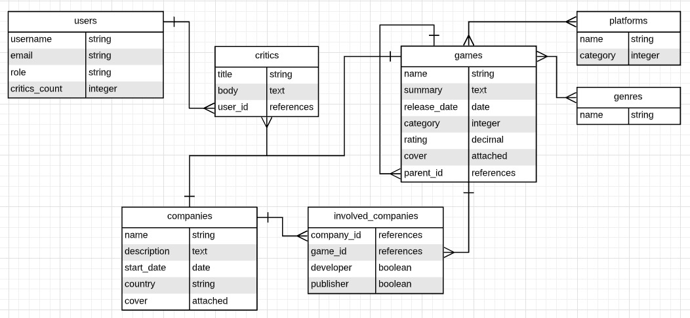
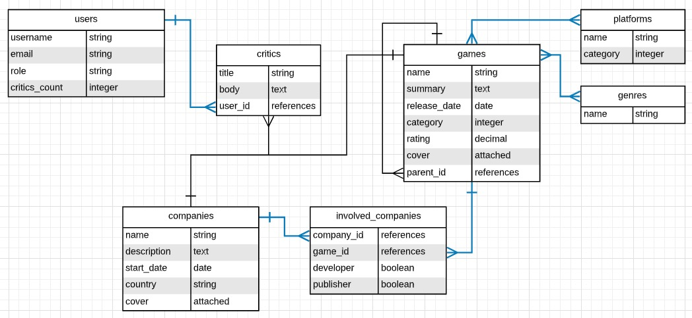

# Associations



That looks more convincing, right?

Now, every Game could have one or more Platforms ("PlayStation 4", "Nintendo Switch", etc.) and one or more Genres ("Shooter", "Racing", etc.). The category field will store 0 if it is a "Main Game" and a 1 if it is an "Expansion" (you can store more categories in this way). That's why the field type is an integer. For games with category 1 (expansions), the field parent_id will store the id of the related "Main Game".

The Platform entity also has a category attribute. This will store numbers representing the "type" of the particular platform like 0 for "console", 1 for "arcade", 2 for "platform", etc.

A Company is involved in the creation of a game as a developer, publisher, or both at the same time. This information is stored on the InvolvedCompany model.

The Users of the platform will make Critics of either Games or Companies. In both scenarios the critic is the same, it has a title and body. We will store the number of critics each user has made on the field critics_count.

## Task 1. Create models and tables

Following the ERD diagram create the following models. Run rails db:migrate after creating each model.

- User

```console
rails generate model User username email role critics_count:integer
```

- Critic (do not worry about the relation with Company and Game yet)

```console
rails generate model Critic title body:text user:references
```

- Company

```console
 rails generate model Company name description:text start_date:date country cover
```

- Game (do not include parent_id field yet)

```console
rails generate model Game name summary:text release_date:date category:integer reting:decimal cover
```

- Platform

```console
 rails generate model Platform name category:integer
```

- Genre

```console
rails generate model Genre name
```

- InvolvedCompany (reference a Company and reference a Game)

```console
rails generate model InvolvedCompany company:references game:references  developer:boolean publisher:boolean
```

Look carefully at the relationship between Platform and Game, and between Genre and Game. Both are many-to-many relationships. But the join table won't store any information besides de foreign keys (for example, game_id and platform_id in the case of Game-Platform relation). In this particular scenario, it is not mandatory to have a model to map the join table. The relation could be mapped only with a special kind of association between the models (more on this coming soon). For now, we will only create the join tables on the database using a migration.

Check the docs to learn how to create join tables using the migration generator.

Then, create the required join tables without creating models (using only migrations).

- docs: https://guides.rubyonrails.org/active_record_migrations.html#creating-a-join-table

- Join table between the table games and the table platforms
- Join table between the table games and the table genres

# Task 2. Create basic model associations

For this task you will need to review these sections of Rails Guides:

## Why Associations?

\*_2 The Types of Associations_ (up to 2.8 Choosing Between has_many :through and has_and_belongs_to_many\*)
After reviewing the guides, create the associations marked with blue:



- A Critic belongs to a user
- A User has many critics

```ruby
class Critic < ApplicationRecord
  belongs_to :user
end
class User < ApplicationRecord
  has_many :critics, dependent: :nullify
end
```

- A Company has many involved_companies and has many games through involved_companies
- An InvolvedCompany belongs to a company and belongs to a game
- A Game has many involved_companies and has many companies through involved_companies
- A Game has and belongs to many platforms

### if not necessary to create another table in the case Game-Platform, because only save game_id and platform_id

```console
rails generate migration CreateJoinTableGameToPlatform game platform
```

```console
rails generate migration CreateJoinTableGameToGenre game genre
```

- A Game has and belongs to many genres
- A Platform has and belongs to many games
- A Genre has and belongs to many games
